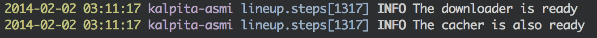

|Build Status| # LineUp - Distributed Pipeline Framework for Python

Lineup is a redis-based
`pipeline <http://en.wikipedia.org/wiki/Pipeline_(software)>`__
framework that turns horizontal scalling seamless.

It's currently providing parallelism through python threads and is
pretty useful for writing systems where the workers make lots of network
I/O.

It scales horizontally, so you can simply run more workers in as many
machines you want.

Installing
----------

.. code:: bash

    easy_install curdling
    curd install lineup

Philosophy
----------

Lineup focus in:

1. Simplicity: easy to create otherwise complex pipelines
2. Easy-scale: just run more workers and you're good.

Defining steps
--------------

Steps must always implement the method ``consume(self, instructions)``
and always call ``self.produce()`` with it's portion of work.

Example: a pipeline that downloads files
~~~~~~~~~~~~~~~~~~~~~~~~~~~~~~~~~~~~~~~~

This is a copy of the `examples <examples>`__ folder.

.. code:: python

    import re
    import codecs
    import requests

    from lineup import Step
    from lineup import Pipeline

    class Download(Step):
        def after_consume(self, instructions):
            self.log(
                "Done downloading %s",
                instructions['url'],
            )

        def before_consume(self):
            self.log("The downloader is ready")

        def consume(self, instructions):
            url = instructions['url']
            method = instructions.get('method', 'get').lower()

            http_request = getattr(requests, method)
            response = http_request(url)
            instructions['download'] = {
                'content': response.content,
                'headers': dict(response.headers),
                'status_code': response.status_code,
            }
            self.produce(instructions)

    class Cache(Step):
        def after_consume(self, instructions):
            self.log("Done caching %s", instructions.keys())

        def before_consume(self):
            self.log("The cacher is also ready")

        def get_slug(self, url):
            url = re.sub(r'^https?://', '', url)
            url = re.sub(r'\W+', '-', url)
            return url

        def consume(self, instructions):
            url = instructions['url']
            name = self.get_slug(url)
            with codecs.open(name, 'wb', 'utf-8') as fd:
                fd.write(instructions['download']['content'])
                fd.close()
                instructions['cached_at'] = {
                    'filename': fd.name,
                }
            self.produce(instructions)

    # Defining pipelines

    class SimpleUrlDownloader(Pipeline):
        name = 'downloader'
        steps = [Download, Cache]

Command line
------------

When running from the command line, lineup will recursively try to
import all python files given as ``--working-dir`` argument, which
defaults to the relative equivalent to ``os.getcwd()``.

In other words it will find your stuff automatically in dir you run the
pipeline from, or from the ``--working-dir`` arg.

Type ``lineup --help`` for more info.

Listing available pipelines
~~~~~~~~~~~~~~~~~~~~~~~~~~~

LineUp scans the given working directory recursively for pipeline class
declarations, here is how you can list all the pipelines that lineup can
find:

.. code:: bash

    lineup list pipelines

Running a pipeline in foreground
~~~~~~~~~~~~~~~~~~~~~~~~~~~~~~~~

.. code:: bash

    # Lineup will connect to this redis
    export LINEUP_REDIS_URI='redis://0@localhost:6379'

    lineup downloader run --output=rpush@example-output

   example/run.png
Feeding a pipeline through command line
~~~~~~~~~~~~~~~~~~~~~~~~~~~~~~~~~~~~~~~

.. code:: bash

    lineup downloader push {"url": "http://github.com/gabrielfalcao.keys"}

   example/run.png
Feeding a pipeline programatically
~~~~~~~~~~~~~~~~~~~~~~~~~~~~~~~~~~

.. code:: python

    from lineup import JSONRedisBackend
    from example.pipelines import SimpleUrlDownloader

    pipeline = SimpleUrlDownloader(JSONRedisBackend)
    pipeline.input.put({
        "url": "http://github.com/gabrielfalcao.keys"
    })

Stopping all running pipelines
~~~~~~~~~~~~~~~~~~~~~~~~~~~~~~

This broadcasts a "stop" signal in the backend.

.. code:: bash

    lineup downloader stop

Contributing
------------

Install Dependencies
~~~~~~~~~~~~~~~~~~~~

.. code:: bash

    curd install -r development.txt

Run tests
~~~~~~~~~

.. code:: bash

    make test

.. |Build Status| image:: https://travis-ci.org/weedlabs/lineup.png?branch=master
   :target: https://travis-ci.org/weedlabs/lineup
